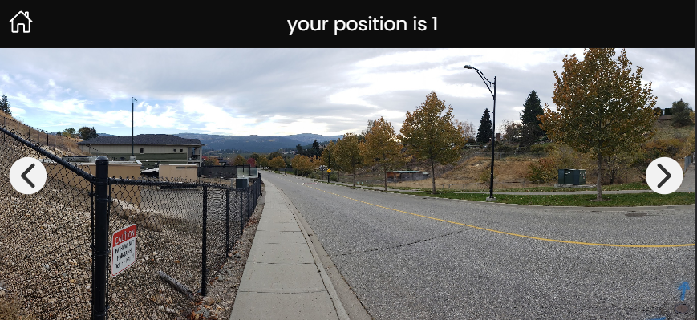
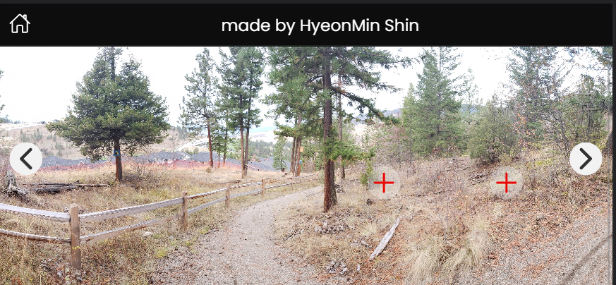

# Task of SotaTek_KR (FE / PM)

## Goal

- create a simple game where you are walking along a trail. 
- You begin your adventure at the bottom of the trail and you hike your way up to the top.
- If you turn around you are facing the other direction. 

## Git

- Commit to GitHub 
- Use single-purpose commits 
- Use [semantic commit messages](https://gist.github.com/joshbuchea/6f47e86d2510bce28f8e7f42ae84c716)
 

## Code

- Use your framework (React, Vue, or Angular) 
- Use Typescript and strongly typed code 
- For design use, Ionic Framework is a plus 
- Unit test is a plus 

## Structure

- All the images will be as a JSON file, you must determine the structure

## Report

- Record how many hours you spent on the project 
- Record what you would improve on if you had more time. 
- Include these in the README.md 

## Assets

- Here are the [pictures](https://photos.app.goo.gl/ioPLWRSakbctgLkb8)

## Design

 - Works on a phone (it is still a website but is mobile first) 
-  Works as a desktop (responsive design) 
- It has scroll left and right buttons that scroll the background image left or right. 

- Has a button over the trail that if you press it you walk there. Like google street view  but simpler
[example]((https://www.google.ca/maps/@49.8741404,-119.3492443,3a,75y,105.46h,77.91t/data=!  3m6!1e1!3m4!1sRhiWMCxfgWeF3VOkgJW3rA!2e0!7i13312!8i6656)

---

## TimeLine

- 14.03.2023

* receive mail about task -> 15:32

> Spent Time to do personal scheduled plan

---

- 15.03.2023

* research about Ionic framework & read document -> 07:20, 15.03.2023

* make structure FE Task on [github](https://github.com/ShinMini/sotatek-task-fe) -> 11:10, 15.03.2023

* success to rebuild the structure for Task of SotaTek -> 15:23, 15.03.2023

* create document & merge feature branch to main -> 15.31, 15.03.2023image.png

* merge: None branch / successfully created a default navigation stack about my process -> 15:50, 15.03.2023

* feat: create assets folder & temp data for fetch as JSON -> 16:50, 15.03.2023

* refactor: clean up styling and create general.css file -> 17:20, 15.03.2023

* refactor: optimize navigation routes by path & feature -> 17:40, 15.03.2023

* feat: create component about images & arrow button -> 18:20, 15.03.2023

### Total: about 10 hours

---

-  16.03.2023

* feat: create scroll button with arrow -> 10:10, 16.03.2023

* feat: create animation move around in map -> 10: 40, 16.03.2023

* feat: create function to fetch data from json file -> 11:00, 16.03.2023

* feat: create mange json data using state -> 11.20, 16.03.2023

* feat: create feature about explore map -> 12:23, 16.03.2023

### Total: about 2 hours

# RESULT

## spent time: about 12 hours

## build by: Ionic framework, React, jest, typescript

## made by: [ShinMini](https://github.com/ShinMini/sotatek-task-fe)

## [video clip](https://youtu.be/NydN3nhuNa4)

