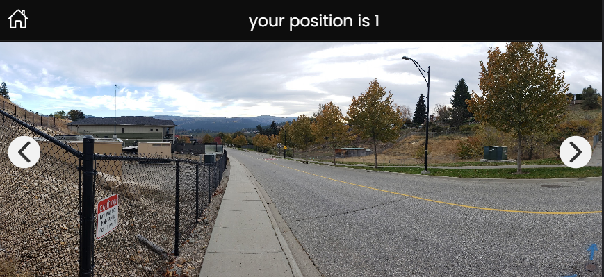

# sotatek-task-fe

---

## TimeLine

* receive mail about task -> 15:32, 14.03.2023

> Spent Time to do personal scheduled plan

* research about Ionic framework & read document -> 07:20, 15.03.2023

* make structure FE Task on [github](https://github.com/ShinMini/sotatek-task-fe) -> 11.10, 15.03.2023

* success to rebuild the structure for Task of SotaTek -> 15.23, 15.03.2023

* create document & merge feature branch to main -> 15.31, 15.03.2023image.png

* merge: None branch / successfully created a default navigation stack about my process -> 15.50, 15.03.2023

* feat: create assets folder & temp data for fetch as JSON -> 16.50, 15.03.2023

* refactor: clean up styling and create general.css file -> 17.20, 15.03.2023

* refactor: optimize navigation routes by path & feature -> 17.40, 15.03.2023

* feat: create component about images & arrow button -> 18.20, 15.03.2023

